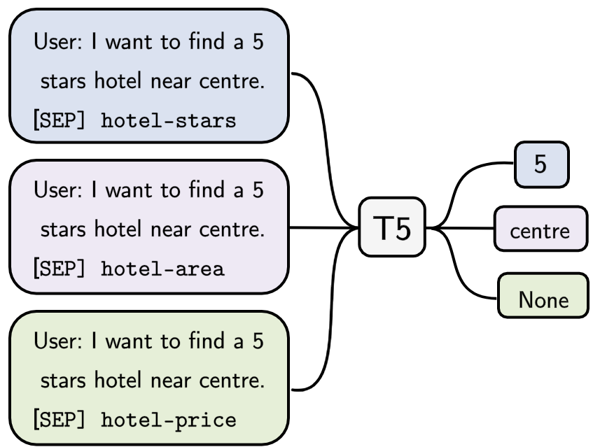
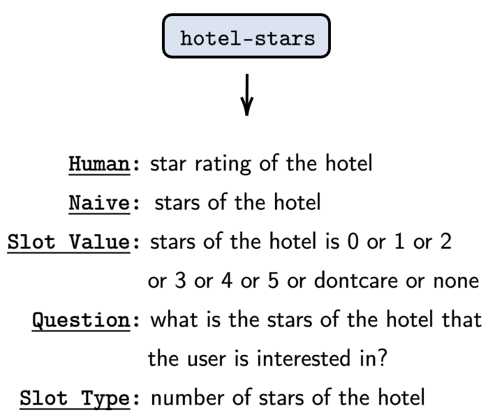

# Leveraging Slot Descriptions for Zero-Shot Cross-Domain Dialogue State Tracking

## Abstract:
Zero-shot cross-domain dialogue state tracking (DST) enables us to handle task-oriented dialogue in unseen domains without the expense of collecting in-domain data. In this paper, we propose a slot description enhanced generative approach for zero-shot cross-domain DST. Specifically, our model first encodes dialogue context and slots with a pre-trained self-attentive encoder, and generates slot values in an auto-regressive manner. In addition, we incorporate Slot Type Informed Descriptions that capture the shared information across slots to facilitate cross-domain knowledge transfer. Experimental results on the MultiWOZ dataset show that our proposed method significantly improves existing state-of-the-art results in the zero-shot cross-domain setting.

## Method:
<p align="center">


</p>
a) Left figure: High-level description of the T5DST. The model (T5) takes dialogue history and slot name (or slot descriptions) as input, and generates the value. 
b) Right figure: Slot description examples.


## Dependency
Check the packages needed or simply run the command
```console
❱❱❱ pip install -r utils/requirements.txt
```

## Experiments
**Dataset**
```console
❱❱❱ python create_data.py
```
use create_data_2_1.py if want to run with multiwoz2.1

**Zero-shot cross-domain**
```console
❱❱❱ python T5.py --train_batch_size 16 --GPU 8 --except_domain ${domain} --slot_lang ${description type}
```
* --GPU: the number of gpu to use
* --except_domain: hold out domain, choose one from [hotel, train, attraction, restaurant, taxi]
* --slot_lang: slot description type, choose one from [none, human, naive, value, question, slottype]
* Note: real batch_size = train_batch_size * GPU_number * gradient_accumulation_steps

**Few-shot cross-domain**
```console
❱❱❱ python T5.py --train_batch_size 16 --GPU 8 --slot_lang slottype --model_checkpoint ${checkpoint} --n_epochs 15 --fewshot 0.01 --mode finetune
```
* --model_checkpoint: saved checkpoint of zero-shot model
* --fewshot: ratio of in-domain data, choose one from [0.01, 0.05, 0.1]

**Full-shot**
```console
❱❱❱ python T5.py --train_batch_size 16 --GPU 8 --slot_lang slottype --n_epochs 15
```
