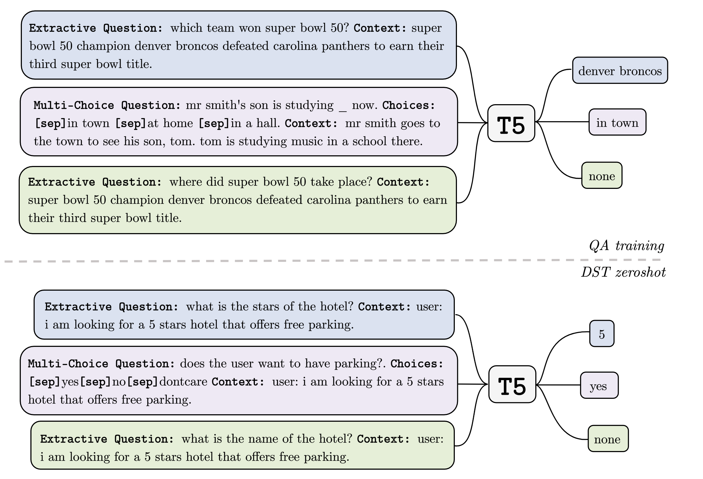

# Zero-Shot Dialogue State Tracking via Cross-Task Transfer

## TransferQA
<p align="center">

</p>
A high-level representation of the cross-task transfer for zero-shot DST (best viewed in color). During
the QA training phase (top figure), the unified generative model (T5) is pre-trained on QA pairs of extractive
questions (blue), multiple-choice questions (purple), and negative extractive questions (green). At inference time
for zero-shot DST (bottom figure), the model predicts slot values as answers for synthetically formulated extractive
questions (for non-categorical slots) and multiple-choice questions (for categorical slots). Note that the negative
QA training allows for the model to effectively handle “none" values for unanswerable questions.

## Dependency
Check the packages needed or simply run the command
```console
❱❱❱ pip install -r utils/requirements.txt
```

## Experiments
**Dataset**
* Download QA datasets:
```console
❱❱❱ ./download_data.sh
```
* Download RACE dataset and put it in qa_data folder, please refer to [**this link**](http://www.cs.cmu.edu/~glai1/data/race/).
* Download SGD dataset from [**this link**](https://github.com/google-research-datasets/dstc8-schema-guided-dialogue).
* Download MultiWoz 2.1:
```console
❱❱❱ python create_data_mwoz.py
```
* preprocess QA data:
```console
❱❱❱ python create_qa_data.py
```

**QA Training and DST Zero-Shot Test**
```console
❱❱❱ python T5.py --GPU 8
```
* --GPU: the number of gpu to use
* Note: real batch_size = train_batch_size * GPU_number * gradient_accumulation_steps


**Few-shot MultiWoz**
```console
❱❱❱ python T5.py --GPU 2 --model_checkpoint ${checkpoint} --n_epochs 20 --mode finetune --fewshot 0.01 --only_domain ${domain}
```
* --model_checkpoint: saved checkpoint of zero-shot model
* --fewshot: ratio of in-domain data, choose one from [0.01, 0.05, 0.1]
* --only_domain: test-domain, choose one from [hotel, train, attraction, restaurant, taxi]

**SGD Evaluation**
The model prediction on SGD can be evaluted by using this [script](https://github.com/google-research/google-research/tree/master/schema_guided_dst).
